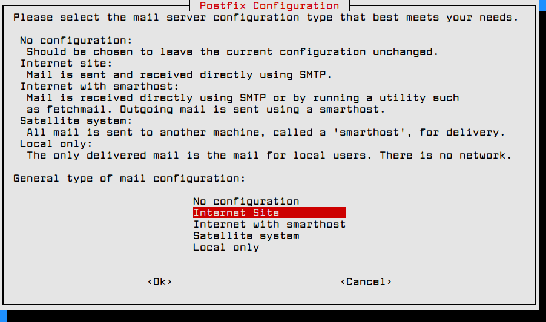

# Create a SMTP server

<br>

## I - Install Postfix :

To install Postfix on Debian, use this command :
<br>
```bash
sudo apt install postfix -y
```

Then, a litle menu should be displayed :

<br>

<br>

Tick `Internet Site` and press `Enter`. Then, the following menu should be displayed :

<br>

<br>

Replace the default content in the bar by your domain name. Example : `tecmint.com` and press `Enter`. The installation should continue normally.

Once done, create a new user called `noreply` or else, but keep in mind that's the user who will receive emails. `sudo /usr/sbin/adduser noreply --home /home/noreply --shell /bin/bash`. Fill fields asking for passwords and personal informations ( that can be empty).

Then, go to `/etc/postfix` and edit `main.cf` file. Add this line : `home_mailbox = Maildir/`. `home_mailbox` Refers to the **path where emails will be saved**. By example, for noreply, it will be `/home/noreply/Maildir`. Hit save and type `systemctl restart postfix` to restart the process. For now, Maildir and it supposed directories haven't be created yet. So, type those commands : `mkdir /home/noreply/Maildir` and then `mkdir /home/noreply/Maildir/{cur,new,tmp}`

<br>

## II - Test the smtp :

First of all, keep in mind that **firewalls and other protections may cause a bug with Postfix**. Also, don't forget to start the service to be able to test the reception.

To try your SMTP, you can use telnet :
<br>
```bash
telnet localhost 25
```

Then, reproduce steps I've done :

<br>

<br>

To test the email sending, just type what is underlined in red. Other lines are telnet responses.

Then, once you for the `Connection closed` message, you can go to `/home/noreply/Maildir/new/` and list all files using `ls -al`. You're supposed to get a new file with a random strings, followed by a dot and your domain name. If you try to read this using `cat <filename>`, you'll get something like this :

<br>

<br>

It contains all informations of the email :

<ul>
    <li>Sender</li>
    <li>Receiver</li>
    <li>SMTP Informations</li>
    <li>Subject</li>
    <li>UTC Date</li>
    <li>Message ID</li>
    <li>Content</li>
</ul>

<br>

## III - Display it :

So, now that you got your SMTP up, you can create a webserver using NodeJS, PHP or else and render the inboxes and create new ones like `spam`, `trash`, etc... to allow users to move their emails in those categories.

Keep in mind that category represents a folder located to `/home/USER/Maildir/`. Also, Postfix don't keep any log about sent messages. It only captures received one.

So, if you want to log them, you will have to use a database where you should stock the sender, receiver, date, etc... to be able to display it in `sent` category.
